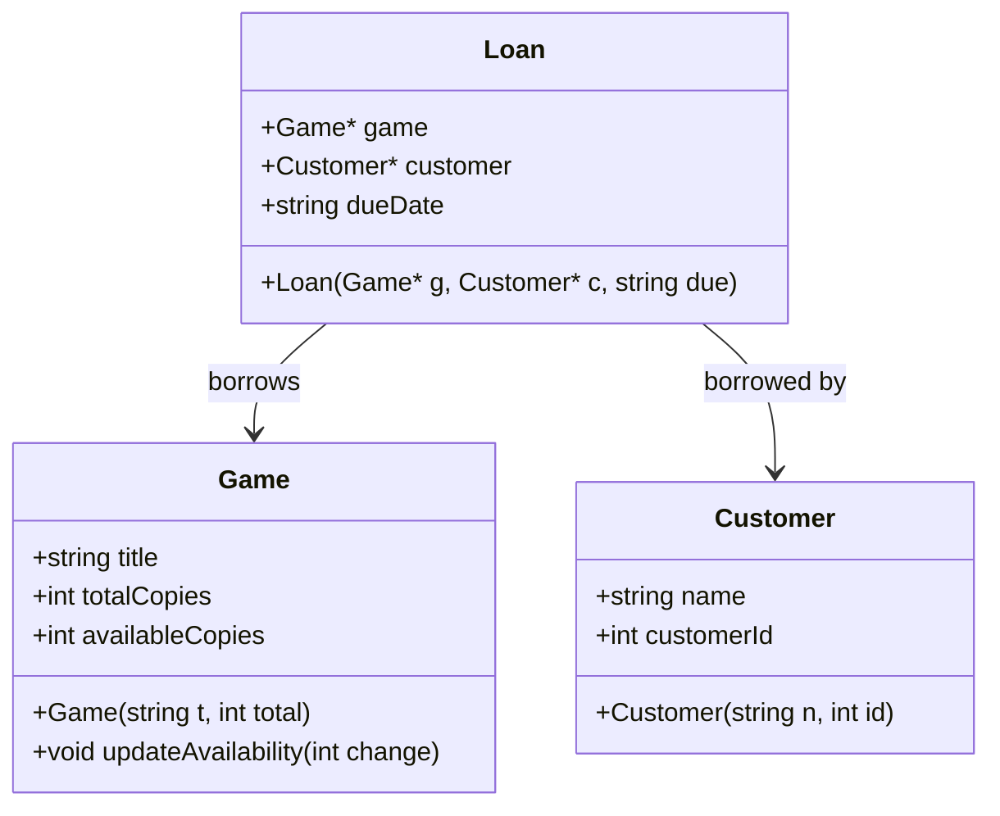

# Program Specification

This program is created to manage the board game lending process for a café. It tracks all board games in the inventory, including the number of available copies, and enables customers to borrow games. The system records who borrowed which games and monitors when games are returned. It offers fundamental functionality for inventory management and game lending.

The key entities involved in this system include games, customers, and lending transactions. The program allows the user to view available games, check out games, and process game returns.

---

## Nouns and Verbs

### Nouns (likely classes or attributes)
- Game
- Customer
- Loan / LendingRecord
- Inventory
- Due Date

### Verbs (likely methods or behaviors)
- Add Game
- Check Out Game
- Return Game
- List Available Games
- Track Borrowed Games

---

## Class Design

### `Game`
```cpp
class Game {
public:
    std::string title;
    int totalCopies;
    int availableCopies;

    Game(std::string t, int total);
    void updateAvailability(int change);
};
```

### `Customer`
```cpp
class Customer {
public:
    std::string name;
    int customerId;

    Customer(std::string n, int id);
};
```

### `Loan`
```cpp
class Loan {
public:
    Game* game;
    Customer* customer;
    std::string dueDate;

    Loan(Game* g, Customer* c, std::string due);
};
```

---

## Mermaid Class Diagram

